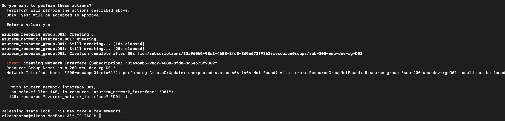

# TF-IAC
#####ERROR####
azurerm_resource_group.D01: Creating...
azurerm_network_interface.D01: Creating...
azurerm_resource_group.D01: Still creating... [10s elapsed]
azurerm_resource_group.D01: Still creating... [20s elapsed]
azurerm_resource_group.D01: Creation complete after 30s [id=/subscriptions/33a960b5-98c2-4688-8fd8-3d5e673f9362/resourceGroups/sub-200-weu-dev-rg-D01]
╷
│ Error: creating Network Interface (Subscription: "33a960b5-98c2-4688-8fd8-3d5e673f9362"
│ Resource Group Name: "sub-200-weu-dev-rg-D01"
│ Network Interface Name: "200weuwappd01-nic01"): performing CreateOrUpdate: unexpected status 404 (404 Not Found) with error: ResourceGroupNotFound: Resource group 'sub-200-weu-dev-rg-D01' could not be found.
│ 
│   with azurerm_network_interface.D01,
│   on main.tf line 145, in resource "azurerm_network_interface" "D01":
│  145: resource "azurerm_network_interface" "D01" {
│ 
╵
Releasing state lock. This may take a few moments...
vikassharma@Vikass-MacBook-Air TF-IAC % 

classic Azure race-condition issue in production code. This is very common: Azure sometimes takes a few seconds to “register” a newly created Resource Group, and if you immediately try to create a NIC (or any child resource), the API returns 404 ResourceGroupNotFound.

1️⃣ Let Terraform Know the Dependency (depends_on)

Even though referencing the RG usually creates an implicit dependency, Azure needs an explicit depends_on for new RGs to avoid this timing issue.

resource "azurerm_network_interface" "D01" {
  name                = "${var.D01_VM_Name}-nic01"
  location            = azurerm_resource_group.D01.location
  resource_group_name = azurerm_resource_group.D01.name

  ip_configuration {
    name                          = "internal"
    subnet_id                     = azurerm_subnet.D01.id
    private_ip_address_allocation = "Dynamic"
  }

  depends_on = [
    azurerm_resource_group.D01
  ]
}

This forces Terraform to wait until the RG is fully created before attempting the NIC.

You can do the same for the VM:

resource "azurerm_linux_virtual_machine" "D01" {
  name                = var.D01_VM_Name
  location            = azurerm_resource_group.D01.location
  resource_group_name = azurerm_resource_group.D01.name
  size                = var.D01_VM_Size
  network_interface_ids = [
    azurerm_network_interface.D01.id
  ]
  depends_on = [
    azurerm_network_interface.D01
  ]
}

